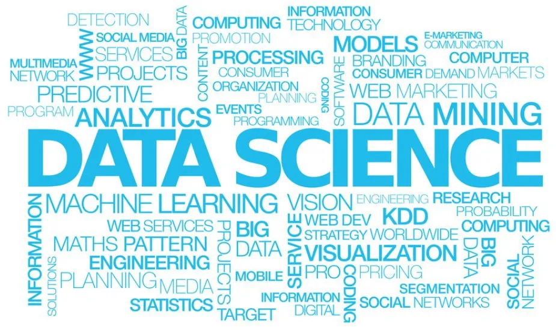

# Defining Data Science

```{r, echo=FALSE, fig.alt="Word cloud of terms in blue text relating to data science, with 'data science' in the center with the largest font size by The Data Scientist"}

```

What is data science? The term emerged in the mid-20th century, but it did not achieve broad recognition as a unique discipline until the early 21st century. The *Data Science Journal* was founded in 2002, and “data scientist” as a job title appeared for the first time in 2005, rocketing to become the “sexiest job” (according to the [Harvard Business Review](https://hbr.org/2012/10/data-scientist-the-sexiest-job-of-the-21st-century)) in 2012. While a data scientist may be commonly described as someone who writes computer code and uses statistics to ask questions, solve problems, and glean insights using data, a universal definition of data science is more nebulous. 

```{r, echo=FALSE, fig.alt="Venn Diagram with data science in the center by Drew Conway"}
knitr::include_graphics("./images/data_science_vd_conway.png")
```

[*Venn Diagram by Drew Conway*](http://drewconway.com/zia/2013/3/26/the-data-science-venn-diagram)


In his seminal article “50 years of data science,” [Donoho (2015)](https://doi.org/10.1080/10618600.2017.1384734) proposed data science as “learning from data, or ‘data analysis’, and scientific studies of data analysis across the spectrum of academic disciplines.” Subsequently, [Cao (2017)](https://dl.acm.org/doi/10.1145/3076253) stated that “data science is a new interdisciplinary field that synthesizes and builds on statistics, informatics, computing, communication, management, and sociology to study data and its environments (including domains and other contextual aspects, such as organizational and social aspects) in order to transform data to insights and decisions by following a data-to-knowledge-to-wisdom thinking and methodology.” Federal funding agencies have adopted these themes, with the National Science Foundation ([NSF 2014](https://www.nsf.gov/attachments/130849/public/Stodden-StatsNSF.pdf)) defining data science as “the science of planning for, acquisition, management, analysis of, and inference from data” and the National Institute of Health ([NIH 2018](https://datascience.nih.gov/sites/default/files/nih_strategic_plan_for_data_science_final_508.pdf)) defining it as “an interdisciplinary field of inquiry in which quantitative and analytical approaches, processes, and systems are developed and used to extract knowledge and insights from increasingly large and/or complex sets of data.” 

At the UC Davis DataLab we embrace the commonalities and nuances of these definitions. Here we refer to data science as the **integrative, multidisciplinary, translational, and transformative process of extracting knowledge and insights from data.** We are committed that these data-driven products should be used for the good.