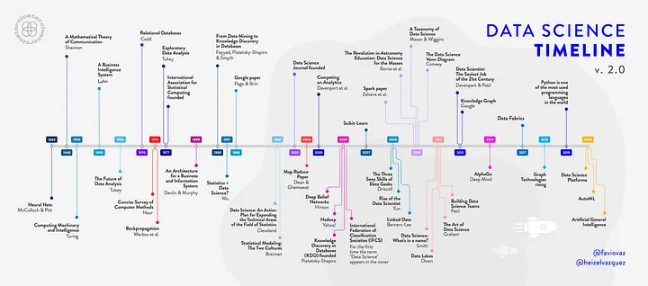

# History in Context

```{r, echo=FALSE, fig.alt="List of events through time with the title 'Data Science Timeline' v. 2.0 by @faviovaz and @heizelvazquez"}

```

[*Illustration by Héizel Vázquez.*](https://towardsdatascience.com/the-roots-of-data-science-77c71115229)

Most descriptions of the history of data science summarize a list of seminal computational and statistical methods published since the mid-1900's, as in the timeline above. But the practice of data science - abstracting complex phenomena into simpler forms to distill and convey meaning - has been going on since before the agricultural revolution. The development and emergence of data science as a new field has been driven and shaped by our historical and cultural landscapes, similarly to all other domains. Here we will contextualize some modern developments of data science to highlight trends and discuss the oppressive emergence, and emancipatory potential, of the field.

## Development of Classic Methods

Francis Galton was a 19th century mathematician and is credited with creating statistical analysis tools still commonly used to this day (e.g., standard deviation) and the Central Limit Theorem. He popularized statistical methods in various scientific fields. He was also racist, a product of the eugenics movement.

Galton developed these statistical methods in an attempt to demonstrate correlations between one’s own fame and the number of one’s famous relatives. Galton claimed that of the men he examined, significant portions of “eminent” fathers produced “eminent” sons, and that “eminent” sons tended to have “eminent” fathers. He concluded that talent (which he interpreted as intelligence) is hereditary. Galton’s analysis is objectionable in many ways: the arbitrary criteria he used to model “eminence,” a lack of consideration to the social factors of having famous relatives, and his willingness to accept the correlation of a single population as evidence of biological fact, to name a few. Modern data science continues to use these same statistical methods, with their nefarious origin story often left untold in introductory statistics and computer science courses.

## Emergence of the Computer

Back in Galton's time (and indeed throughout most of human history), data were scarce. Statisticians often only had access to data they created themselves or with close collaborators. These data were highly localized, accessible only wherever they were recorded, and the capacity to process it limited as mathematicians attempted to analyze it by hand. In this era, individual and societal motives and values had tremendous impact on the accuracy and validity of emerging data-driven methods and their subsequent applications. The rise and commercialization of computers, with their ability to store and share large datasets as well as crunch complex actions, is hailed as a hallmark for democratizing data and making data science more accessible to the general public. But as with Galton, the origins of the technologies enabling this shift were driven by societal needs at a time of war.

In March 1940, the invention of the Bombe computer exponentially increased the computational power available. British cryptanalyst Alan Turing created Bombe to decrypt the Nazi Enigma machine, which secured Nazi lines of communication by obscuring them through a complex cipher. The Enigma machines could create 150 trillion unique ciphers using a system of three rotors, and ciphers were changed daily. The Bombe iterated through possible rotor combinations until an expected phrase was found, and programmers would check if this combination revealed the encrypted message. With the creation of the first computer, the dynamic between data availability versus processing power tipped. 

## Rise of Big Data

The ability of compute power to outstrip available data did not last for long. In 1951, magnetic tape was used in computers, allowing data to be stored at a capacity of 128 characters per inch and read at speeds of 12,800 characters per second. By 1954, researchers at IBM and Georgetown University unveiled the 701 Translator. This machine utilized six rules in an attempt to translate Russian to English. It used direct translation of certain words, substitution given limited context, and rearrangement to best fit the English language based on statistical methods. But the goal of this translator wasn't to revolutionize the literary community and increase access by automating translations. It was designed for use by United States intelligence community against the Soviet Union. It was far cheaper to train an English speaker to use the machine than to learn Russian. Incidentally, the computer was less accurate than trained translators and ultimately intelligence agencies still rely on human translators to this day. But the technological advance However, the attempt revolutionized the data collection and storage capabilities. This type of data storage was scalable, and allowed for the creation of what we would call “big data” today. 

## Illusion of Computational Objectivity

Corresponding increases in compute technologies to meet the needs of big data cast a veneer of objectivity and fairness onto the field. Systems of oppression are human-created, so machine-driven processes and inferences seemed free from the subjectivity of Galton's era. But, the data and computational models themselves are not free from human decision. 

Who decides which sentences are included or excluded from a natural language dataset? Who decided that the vast majority of crash test dummies should represent an ‘average male body’ or, for that matter, what an ‘average male body' even is? What implications does this have for drivers whose bodies do not conform to those proportions? When crime-prediction datasets are based on historical data on policing, and image datasets contain significantly more white people that people of color, it's impossible to escape from cultural bias. Whenever data are collected, subjective decisions informed by societal values inevitably impact resulting decision-making models. In our culture, undercurrents of colonialism, white supremacy, and the patriarchy pervade all fields - including data science. 

Have we really progressed beyond the biases of Galton?
