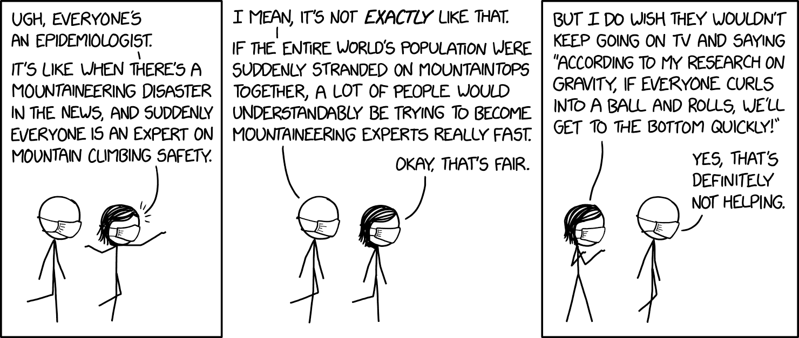
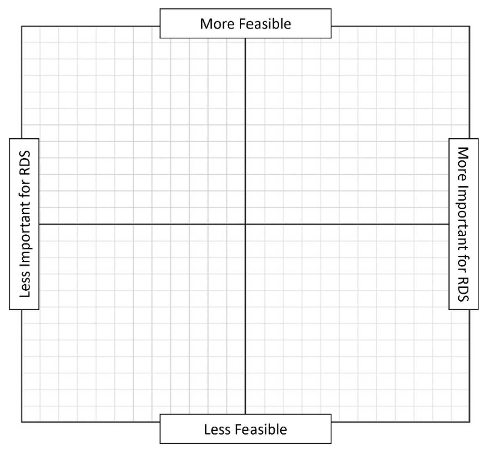

# The  FACT of Data Science 

*“Responsible data scientists take steps to make data they depend on FAIR
(findable, accessible, interoperable, reusable) while ensuring the FACT
(fairness, accuray, confidentiality, transparency) of the algorithms and tools
they create… their work must be placed in the context of broader social, legal,
ethical aspects.” -Digital Society*

A prominent advocacy movement for responsible data science practices is FACT.
This philosophy for data science describes four core areas where we can take
responsibility in our data science practices: Fairness, Accuracy,
Confidentiality and Transparency. They are not the only factors that contribute
to responsible, equitable and just data science, specifically on their own they
do not define what relevant contexts are important in avoiding continued
structural inequity. However, it does provide an accessible framework with
which this workshop will extend to include consideration of historical,
socio-technical and structural inequities. Below we will discuss each in turn
along with specific actions that will help you develop more responsible and
equitable data science practices.

## Case Study: Carbin App for Pothole Identification 

**Summary**: In an attempt to reduce the carbon emissions in highly populated
areas, a multi-campus contingent consisting of 6 undergraduate and graduate
data scientists and 5 faculty members (MIT, UMass Dartmouth, Harvard and
Birzeit University in West Bank Palestine) developed algorithms that use
accelerometers, navigation software, and other proprioceptive technologies
built into most smart phones to identify road conditions. Bad road conditions
substantially increase carbon emissions from vehicles. Data: Originally they
had planned to develop the app for iPhones specifically, however, one of the
students observed iPhones are much more expensive than Android phones and are
used disproportionately by those who live in wealthier areas of both Cambridge,
USA and West Bank, Palestine. In fact, iPhones are widely inaccessible to
Palestinians, so the team developed the app for both types of phones to
accommodate for the SES and location-based biases that would result from using
only iPhone data. In addition, they recognized the SES imbalances of who has
access to cars and utilized volunteers as well as some public transportation
services (buses) to gain data in areas that may not be accessed due to lack of
local drivers, or drivers without smartphones. 

**Methods**: The team recognized that algorithms are likely to pick up on
differences in driving style for individuals, weather conditions, and cultural
norms. They use highly sophisticated math derived from extensive beta-testing
in order to adequately isolate movement caused by road conditions apart from
driver-created turbulence. 

**Communication**: The team behind Carbin has clearly put thought and work
behind their presentation of the software. They use cross-cultural
collaboration, consulted with technology experts in other universities. They
have developed an informative and accessible website that outlines the goals
and expectations for the project. They also communicate the potential disparate
impact surrounding using crowdsourcing alone to collect road condition data,
and aim to combine crowdsourcing with strategic deployment of drivers to
collect data in disadvantaged areas.

## Fairness The data science pipeline (from data collection and management to
the development of computational methods for analysis, communication, etc.)
should be free from bias. In this case, bias refers not only to prejudices such
as racism, sexism, ableism, etc., but also to uncovering the imbalances and
unrepresented components in our data. Fairness means that you should only
interpret the data with its specific context in mind. Every dataset reflects
the biases of the society in which it was produced. If your project touches on
sensitive issues or vulnerable populations, it must from the beginning also
include collaborators with in-depth cultural and ethical understanding of the
issues and context of the data. For projects that do not explicitly interface
with such issues and peoples, it likely does so implicitly. No researcher
should assume that their work is without fault to marginalized communities and
should always consider the sociocultural contexts in which their work is
carried out.

### “Correcting for Bias”

Fairness algorithms in machine learning attempt to account for data biases in
one of three ways. The first is referred to as post-hoc fairness, that is,
taking a trained model and rearrange its output to be more equitable. What
“more equitable” means is up for debate with over twenty definitions[cite] of
fairness used in the literature, but typically implies trying to balance the
number of people of different protected status variables (PSVs, eg race, sex,
gender, marital status, etc.) in the various decisions the learner could make.
For example, if a black box model is in charge of determining riskiness for a
loan, a data scientist may take the output of the model for a population and
rearrange the output so that people of different races are treated equally
(e.g., getting the loan and being denied).

Rather than making post-hoc decisions, models can also learn to be more fair by
propagating a fairness signal. In the same way that a learner processes data
and is trained based on how close it got to perfect accuracy, one can train a
network so that it predicts people of different PSV’s similarly. Finally,
models can also learn to be fair through an adversarial training process.
Adversarial learning is the process of training a model alongside an adversary
with opposite goals. For fairness, the adversary will look at the output of the
learner and try to determine the PSVs of the datum. The model must not only
learn how to make predictions about data correctly, but do so in a way that the
adversary cannot determine the PSVs of the data.

These styles of fairness can be useful in overcoming very direct and overt
biases towards particular marginalized groups, and may be a decent starting
point for addressing the larger issues of equity in data science, however this
still leaves a lot to be desired. These algorithms tend to only look at one
very specific type of discrimination and almost never consider the intersection
of different attributes. We can make an algorithm fair with respect to
individual protected status, but this gives no guarantees that the model will
be fair to combinations of such groups. In practice, fairness algorithms are
frequently only applied to binary PSVs, or PSVs are binarized to work with
existing algorithms. Data scientists will group people into a binary and assume
one group will be privileged, and the other oppressed. This is concerning in
its own right as it is a textbook example of erasure, but it also obfuscates
potential forms of bias that may exist in a model. Further, fairness algorithms
are only able to look at a small piece of the whole. Most fairness datasets
used in research only look at a single protected status - some algorithms can
only optimize on a single PSV - and at the most only 3 PSV’s will be examined
at a time. Fairness algorithms assume that PSVs are immutable characteristics
of a datum. For example, certain groups of people have been considered a “race”
at different points in United States history, and one group of people may be
racialized in one society, but not another. Fairness algorithms cannot take
this into account. Finally, fairness algorithms and laws governing them provide
an easy “out” to the problem of doing data science for equity. If we use a
fairness intervention and demonstrate statistical parity, equalized odds, etc,
this provides the false impression that we fixed the problem, when in reality
there is always the possibility that an algorithm can be unfair in a specific
context.

While these approaches are better than nothing, they are based on false
assumptions about discrimination and are often incapable of evaluating more
complex forms of discrimination. Fairness is an aspect we need to be constantly
vigilant about, not a check box to tick before shipping out a product.

### Case Study: Crowdsourcing City Governance 

**Summary**: Departments of housing and transportation in cities across the
U.S. have begun using data-driven technologies to make governance decisions
(e.g. building development, road improvements, policing patrols, resource
allocation etc.) A vast majority of the data used to inform their decisions are
collected through “311” complaint hotlines/online reporting. Crowdsourced data
can give real-time snapshots of the conditions in different parts of the city,
which can be important for future planning as well as emergency response. 

**Fairness Concerns**: Reporting behaviors have disparate cultural and
historical impacts are different communities in urban areas. Not only are
privileged {people who live in a place} more used to asking for what they need,
they are also more used to having those needs met with reverence. Conversely,
the historical oppression of BIPOC communities by government entities has led
to a culture of self-governance and distrust of authority. These known cultural
differences have led to major imbalances in crowdsourced 311 data. Wealthy
white neighborhoods are more likely to have a higher frequency of calls
regarding a wider range of reported content. Whereas, neighborhoods with
objectively a higher rate of infrastructural decay are less likely to be
reported through official channels and are not represented in the crowdsourced
data. The data-driven decision-making is unlikely to correctly account for the
bias in the crowdsourced data further contributing to the inequities in
resource allocation and distrust for city governance by underserved
populations. 

## Accuracy 

When discussing equity and justice, it is often said impact is more important
than intention. However, it is also understood that it is impossible to
completely control the impact our actions have on any single individual. This
is true for research. Most areas of research responsibility involve factors
that are difficult to control as researchers. However, we have the most control
of the accuracy or quality of the research we produce. To ensure accuracy of
data science research, the methods we employ should be backed by theoretical
understanding of the inferences and interpretations that are possible through
such methods. In addition, we should be utilizing practices that follow
statistical and methodological rigor with respect to the context of the data we
are using. The abundance of available data allows for greater exploration into
datasets by anyone with access and at least a minimal understanding of
statistical software. Many of the spurious correlations that are reported and
gain traction in popular “science” blogs/news are the results of irresponsible
data science methods used by researchers (academic or industry) without
theoretical understanding(or purposeful ignorance) of the statistics underlying
the method or the context in which the data was collected.

Misinterpretation of model output is also a concern in data science methods.
Often our models are very complex, so the interpretation of the results and
description of what the model is doing can be difficult to clearly present in
non-technical language. However, it is the job of the data scientist to be sure
that their audience is deriving an accurate interpretation of the results. The
other major concern regarding accuracy of interpretations from results and how
they are communicated is what we call “visualization crimes”. Even if data is
unbiased and correctly analyzed, the results can be visually presented in
misleading ways. We won't go too deep on this topic as there is a wonderful
primer on Data Visualization. However, bad data visualization can lead to
base-rate fallacies and a conflation of relative vs. absolute risk/probability,
so an increased accountability regarding the use of visualizations is needed to
promote responsibility through accuracy in data science. 

### Case Study: Gender and Mentorship 

**Summary**: Authors used publication and citation network data which contains
author names, affiliations and publication venues for individual papers as
nodes with directed connections between nodes indicating papers cited by each
paper. They used this data to derive impact measures, gender using a publicly
available gender classifier on the names of authors and academic age (#years
from first publication) for each author represented in the dataset. From those
derived metrics, the authors created mentor-mentee dyads determined by same
institutional affiliation and the difference in academic age at time of
publication(see paper for more details). In addition to network data, the
authors surveyed the identified “junior” researchers regarding their
experiences with their mentors. They then sorted mentees based on how much of a
“big-shot” the mentor is (their derived impact) to compare the surveyed
mentees’ perceived quality of mentorship. The article uses the combination of
survey collected measured and network data to report that “big-shot” mentees
result in higher ratings of satisfaction with mentee relationship as well as
better mentee impact. They also conclude female mentors are less beneficial to
female mentees than male mentors with regard to impact, and that female mentors
lessen their gain by mentoring female students compared to male students. They
do not report any survey findings on the basis of mentor or mentee gender. 

**Accuracy Concerns**: This article was very quickly retracted after its
publication due to the mentorship & gender interpretations of the results.
However, there are many methodological problems that likely affect the accuracy
of their claims. I address a select few in detail below. Gender classification.
First and foremost, the gender determination method likely introduced
inaccuracy and bias. The classifier used gives a probability value for male or
female given a full name and country of origin. It is unclear how the authors
determined the country of origin for each author. Given the high immigration
rates of academics institutional affiliation would be a poor indicator of
author origin. It is assumed that the classifier returns the gender that is
most probably given the name, however it was not specified by the researchers.
The authors reported an “error-rate” of 7% for gender classification, however
it did not specify how it determined that error-rate. In fact, recent studies
have shown that the specific gender classifier used in this research is
incredibly inaccurate for non-anglo names and did not take any non-binary
gender identities into account through classification(Wilson et al, 2022).   In
addition, not only were non-binary identities left out of the classification
process there was not even a mention of the potential presence of non-binary
genders in academia. 

**Mentor-mentee pairs.** The determination of mentor-mentee relationships allow
for extreme amounts of bias and noise. The determination was made based on the
academic age at time of publication between authors. On all publications any
author with an academic age below 7 was considered a mentee and any author with
an academic age over 20 was considered a mentor if they share an affiliation in
at least one charred publication. In the age of large scale collaborations,
this definition of mentor mentee relationships is likely very inaccurate. 

**Survey data.** The response rate to the 2000 junior scientists surveyed was
8%, which is fairly standard for survey research, however the sensitive nature
of the question is likely to influence not only how participants respond to
survey questions, but also who responds to the survey. The data is likely to be
highly unrepresentative of junior researchers overall. In addition, due to the
way that mentor-mentee pairs are derived, mentees are likely to have multiple
mentors. Based on what was reported the survey did not have respondents specify
who their mentor was, so matching survey responses to network derived
mentor-mentee pairs and impact is not appropriate. There is no guarantee that
the surveyed research is describing the same relationship represented in the
network. The results for mentor quality by derived metrics are meaningless. 

**Mentor-mentee gender results.** In addition to the bias introduced by the
gender classifier, the gender comparisons made by the authors in determination
of mentee and mentor success is highly biased. The results were interpreted as
ineffectual mentoring by female mentors for female mentees compared to male
mentors. However, researchers did not account for a variety of known factors
that could account for the finding. For instance the general gender bias in
publication (very well documented) can easily explain both the low impact on
female mentees and mentors. Of course, female researchers who publish with male
researchers (whether they are male mentors or male mentees) will have higher
publication/citation rates. In addition, data does not account for
retention/graduation rates of female mentees which has been well documented to
be lower for male mentors than female mentors. I will point out that the
researchers' results are exploratory (aka not part of their original research
question). However, they make a point of interpreting the data not as evidence
of gender bias in citations (documented in many other places), instead their
interpretation implies that female students are better off with male mentors
which is counter to the actual research on the subject.

## Confidentiality

In order to engage in data science we need data, and in our digital age there
is an abundance of data available. However, not all data is created equally.
We’ve already talked about how bias or inaccuracy can result in shoddy data
science, the proverbial garbage  in → garbage out, but even if data is high
quality, there still remains the question of whether responsible data science
can be done with data obtained through unethical and inequitable means.

### Privacy and Data Stewardship

In practice, data is often collected with a lack of regard towards the privacy
and well-being of those who it represents. When datasets are published or
shared, it becomes difficult to address issues after the fact, as the dataset
may already be downloaded to dozens of computers. In 2018, Microsoft computer
vision teams announced that they had addressed issues surrounding poor accuracy
in a “gender classifier”, a network designed to group individuals into a gender
binary given a picture of their face, by diversifying the array of skin tones
in the data provided. The team reported that their fairness intervention
reduced error rates for “men and women of darker skin” by twenty times, and
accuracy for women overall by a factor of eight. Setting aside the issue of
enforcing a gender binary and the ethical implications of facial recognition
for this purpose, the data itself posed privacy concerns when people found
images of themselves on this dataset without previously consenting to be part
of this dataset, tracing back to Flickr posts. This invasion of privacy and
disregard of consent is not an isolated incident. Researchers at the University
of North Carolina scraped YouTube videos for people undergoing hormone
replacement therapy to bolster their facial recognition datasets without
considering the potential implication this has on those individual’s safety.
The lack of data stewardship, or oversight to the collection and propagation of
this data, poses serious risks to the communities they ostensibly serve.

Many online databases (whether they come from social media sites, computer
games, news apps, health trackers, etc.) have online APIs where access can be
gained for free, often through a simple application process. Many of us know
the controversies surrounding buying and selling data in big tech. From
concerns regarding surveillance capitalism to copyright and ownership of our
own online contributions as intellectual property, everyone is impacted by
these concerns in some way. However, as academics, we assume that the general
public has the same or similar understanding of the implicit consent that
occurs when engaging with anything online. We can rationalize the usage of
social media APIs and scraped datasets because as users ourselves we know that
everyone has clicked the “Terms and Agreements” check box when making an
account. While legally this is an acceptable rationalization. However, there
have been significant movements and calls to action to change the standard
internet data ownership and sharing to a system more in line with human
subjects research by requiring informed consent. Proponents for this model of
user data storage and sharing argue it is the responsibility of the platform to
ensure that its users are actively and knowingly opting-into “surveillance”
rather than our current system where there might be ways to opt-out as a user.
By simplifying the language in “terms and conditions”, prominently displaying
the “terms and conditions” and allowing for user flexibility in consenting to
each data collection/storage usage are all ways to limit the potential abuse of
data buying and selling. 

### De- and Re-Identification of Data

Regardless of the ownership status of our data, science has strict autonomy and
privacy protections for individual data. Many big data suppliers remove direct
identifiers like names, addresses (IP and physical), social security numbers,
etc from data that is shared with data scientists. However, even traditionally
“de-identified” data often contains enough personal information that very
creative or determined data mining techniques may still be able to tie
individual identity to their online data. This re-identification process poses
a danger to the individuals by leaving them susceptible to identity theft,
doxing, leaking of sensitive personal information, etc. Each of which can have
disastrous consequences for individuals. The best way to protect individuals’
data privacy is by only sharing data relevant to the analyses or questions
relevant to your project. Minimizing the collection of identity specific
information, such gps level location data, searches or purchases related to
sensitive/protected information (health, sexual or gender identity, religious
affiliations, political identities, racial identities) unless absolutely
necessary, and even then with specific data protections in place. 

### Case Study: New York City Taxi Data

**Summary**: In 2014, New York city released data from 173m individual taxi
trips including: pick-up and drop off location, time, date, “anonymized”
license number and medallion(taxi ID) number, and other meta-data. The data
release was aimed at promoting an eco-themed “hack-a-thon” to crowdsource ideas
to improve the ecological impact of NYC taxis services. They anonymized the
data as a way that would still allow for connecting taxi trips longitudinally,
to allow for analysis of individual driver patterns and used hashing to
anonymize both license and medallion numbers. 

**Confidentiality Concerns**: Hashing the identifying information allowed the
full number to be reverse engineered due to the non-randomized hashed values.
In addition, the longitudinal data released allows data scientists to estimate
how much each driver makes each day.  The combination of time-stamped and
location allows a data scientist to infer the home address of drivers. In
combination with other publicly available information from the NYC Taxis
commission a drivers name can easily be mapped to their driver’s license and
taxi medallion which could provide major safety concerns for drivers and
passengers. Sensitive passenger information could also be potentially
identified from geographical locations of trips starting a drop off location. 

## Transparency

The push toward transparency in science broadly is often referred to as the
Open Science movement. Excitingly, data scientists from many different academic
disciplines have been at the forefront of this movement which is not a surprise
since it is the products that come from data science practices and research
that have allowed for many of the tools that facilitate transparency in
science. 

### Open Access as Freedom of Information

Often when we talk about transparency, there is also an implication of
accessibility (Open Access). Transparent documentation of data or methods are
not worth much if they are not made publicly available. Open access allows for
a freedom of information that has led to many amazing developments
scientifically, but also more broadly. There is growing evidence the cross
disciplinary collaboration (which has been facilitated by data sharing and open
access publishing) results increase scientific progress measured by information
gain and novelty. In addition, there is evidence that transparency increases
the diversity in scientific topics of study and by extension greater
accessibility for diverse scientists who are underrepresented in academia.
Preprints through open access databases have been a major tool of transparency
and accessibility in recent years. Accountability 

Another important reason that transparency is important is for accountability.
According to Merton (1957) science is a self-correcting process. Through review
and repeated testing, inaccurate findings will eventually be replaced with
finding closer to ground truth. However, for repeated testing (or replication)
to happen we must have transparency in the exact methods and procedures used to
collect and analyze data. Accountability is important for this self-correction
process in science, because we must be able to not only identify inaccurate or
irresponsible data science. We must be able to change the practices that
resulted in the problem.

### Research Outcomes Ownership

Previously we have talked about data ownership from the perspective of who the
data describes; here we are switching focus to talk about ownership or
authorship of research outcomes. In a system which incentivizes priority and
productivity as a measure of prestige it is understandable to be worried about
scooping (Another scientist publishing a research idea/outcome that was shared
by another scientist but wasn’t finished “fast enough”). It often seems counter
to academic and financial incentives to share data which can allow other data
scientists to make discoveries that, given enough time, could have been made by
the original owners of the data. However, by pre-registering  your research
questions, hypotheses and methods on online repositories like OSF, you can
document and copyright the research to protect your intellectual property and
mitigate the occurrence of scooping. In addition, blockchain allows for
ownership markers in data to protect data from being claimed by people other
than those who created or collected the data. It also allows us to easily
connect data to comprehensive data biographies such as those discussed in other
sections of this workshop. 

### Case Study: Everyone’s an Epidemiologist 

```{r, echo=FALSE, fig.alt="Cartoon by xkcd called Everyone's and epidemiologist."}

```

[*xkcd*](https://xkcd.com/2300/)

**Summary**: COVID-19 is undeniably the first (or at least most impactful)
modern global pandemic since the development of large scale data science
methods. Accessibility of data has allowed epidemiologists to identify
infection rates, risk factors, disease symptoms, geographic and racial
disparities. They have also used real-world datasets along with mathematical
and statistical modeling to develop contact tracing methods and policy
recommendations. In addition, transparency in science has allowed for rapid
information sharing for COVID-19 researchers that allowed for fast and
effective developments of treatments, vaccines and prevention techniques.

**Transparency Concerns**: Unfortunately, transparency can also perpetuate
irresponsible data science. This was demonstrated most recently through
COVID-19 research. The data and methods used by epidemiologists, who have been
trained in the theoretical, practical and ethical nuances of disease
transmission models, are now accessible to anyone with advanced
statistical/computational knowledge without the same domain specific expertise.
In addition, the large amount of funding made available to research related to
COVID-19 incentivizes researchers from every domain to start tackling questions
related to prevention and treatment of COVID-19. In theory, this seems like it
would be a positive. However, disease transmission is much more complicated and
nuanced than simple contact tracing.  Predictive models must consider
biological and ecological factors that surpass what other mathematical or
statistical modelers might expect. These incentives led to impacted COVID-19
publication rates for COVID-19 research that led to a slow down of publication
of trained epidemiologists. In addition, open access practices such as
pre-prints allowed non-experts to disseminate their research with ease
regardless of the accuracy of those findings. This led to the massive amounts
of wide-spread misinformation regarding COVID-19. 

## Applying FACT

Thinking about your specific field of study, how would you rate the feasibility and importance for producing equitable, responsible research for each FACT element?

```{r, echo=FALSE, fig.alt="Four quadrant graph with more to less feasible on the y-axis and less to more important for RDS on the x-axis."}

```
